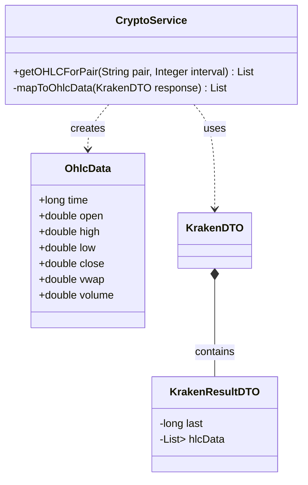

```mermaid
classDiagram
    class CryptoService {
        +getOHLCForPair(String pair, Integer interval) List<OhlcData>
        -mapToOhlcData(KrakenDTO response) List<OhlcData>
    }

    class OhlcData {
        +long time
        +double open
        +double high
        +double low
        +double close
        +double vwap
        +double volume
    }

    class KrakenDTO {
    }

    class KrakenResultDTO {
        -long last
        -List<List<Object>> hlcData
    }
    
    CryptoService ..> KrakenDTO : uses
    CryptoService ..> OhlcData : creates
    KrakenDTO *-- KrakenResultDTO : contains
```