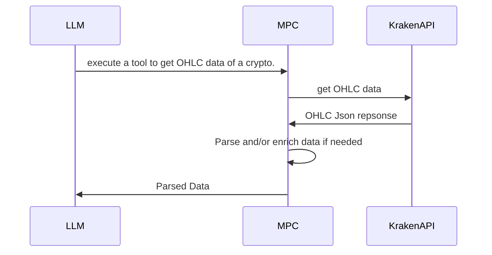
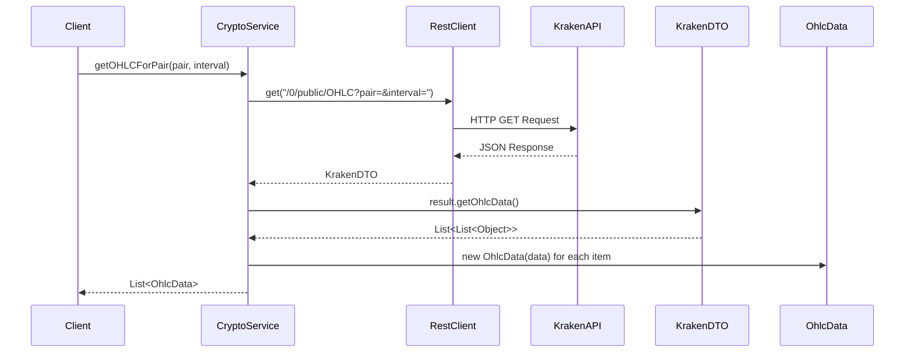

```mermaid
sequenceDiagram
    participant LLM
    participant MPC
    participant KrakenAPI

    LLM->>MPC: execute a tool to get OHLC data of a crypto.
    MPC->>KrakenAPI: get OHLC data
    KrakenAPI->>MPC: OHLC Json repsonse
    MPC->>MPC: Parse and/or enrich data if needed
    MPC->>LLM: Parsed Data


```

### Dentro del MCP, nuestra applicación.sequenceDiagram

```mermaid
sequenceDiagram
    participant Client
    participant CryptoService
    participant RestClient
    participant KrakenAPI
    participant KrakenDTO
    participant OhlcData

    Client->>CryptoService: getOHLCForPair(pair, interval)
    CryptoService->>RestClient: get("/0/public/OHLC?pair=&interval=")
    RestClient->>KrakenAPI: HTTP GET Request
    KrakenAPI-->>RestClient: JSON Response
    RestClient-->>CryptoService: KrakenDTO
    CryptoService->>KrakenDTO: result.getOhlcData()
    KrakenDTO-->>CryptoService: List<List<Object>>
    CryptoService->>OhlcData: new OhlcData(data) for each item
    CryptoService-->>Client: List<OhlcData>
```
